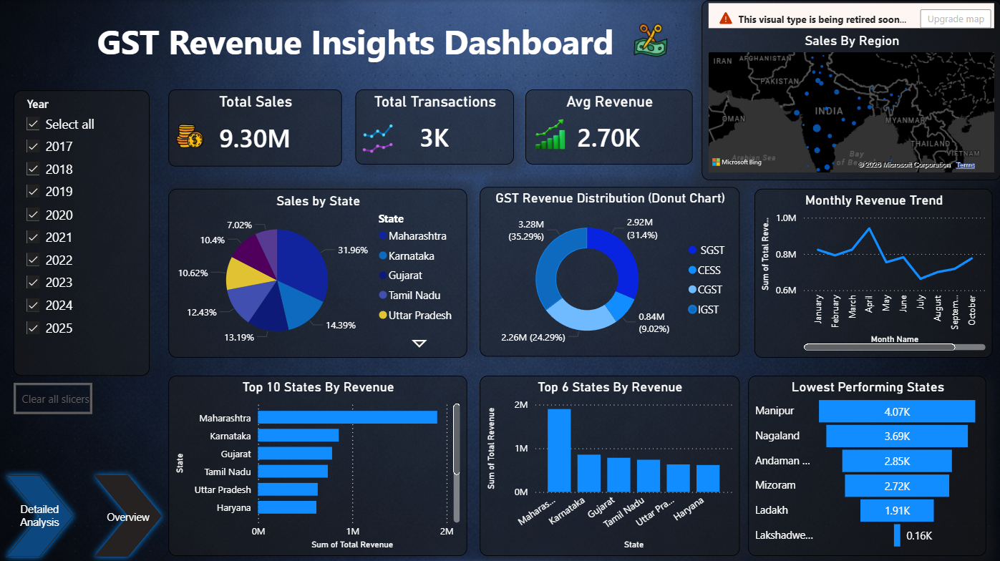

# GST-Revenue-Dashboard
Power BI dashboard analyzing GST revenue trends and state-wise performance
# GST Revenue Insights Dashboard 📊

## 📌 Project Overview

This project presents an interactive Power BI dashboard analyzing GST revenue data across different states in India.

## 🎯 Objectives

* Analyze total GST revenue
* Compare state-wise performance
* Identify top and lowest performing states
* Understand GST components (CGST, SGST, IGST, Cess)
* Analyze monthly revenue trends

## 🛠 Tools Used

* Power BI
* NDAP Dataset (Government Data)

## 📊 Features

* KPI Cards (Total Sales, Transactions, Avg Revenue)
* State-wise Revenue Distribution (Pie Chart)
* GST Component Analysis (Donut Chart)
* Regional Analysis (Map)
* Monthly Revenue Trend (Line Chart)
* Top & Bottom State Analysis
* Interactive Slicers & Bookmarks

## 📷 Dashboard Preview

## 🚀 Insights

* Maharashtra is the highest revenue-generating state
* Some states contribute very low revenue (Lakshadweep, Manipur)
* Revenue shows monthly fluctuations
* SGST & CGST contribute major share

---
